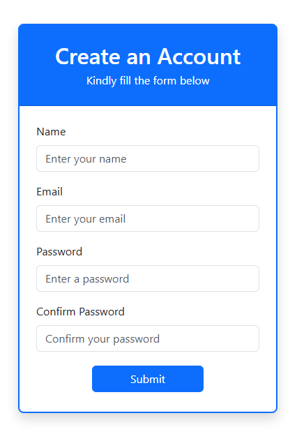
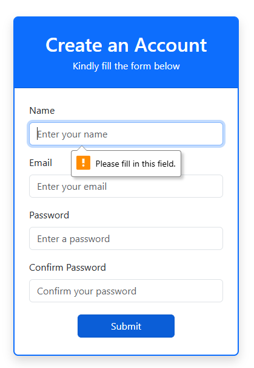
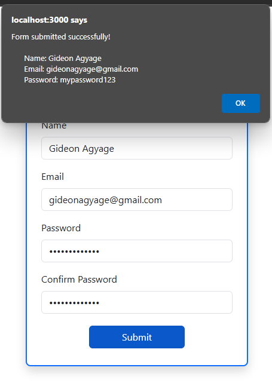

# Dynamic Form in React JS

## Overview

This project is part of the Codevixens Frontend Development Challenge (Day 2). The goal is to build a dynamic form using React JS, focusing on handling user input, validation, and state management.

## Features

- **Dynamic Form**: A form with multiple input fields, each with its own validation rules.
- **State Management**: Utilizes React's useState hook to manage the form data and validation errors.
- **Input Validation**: Implements validation rules for each input field, providing real-time feedback to the user.
- **Error Handling**: Displays error messages for invalid input values.
- **Form Submission**: Handles form submission and displays a confirmation message with the submitted data.

## Installation

1. Clone the repository:

```bash
git clone https://github.com/gideonagyage/dynamic-form.git
```

2. Navigate to the project directory:

```bash
cd cd dynamic-form
```

3. Install dependencies:

```bash
npm install
```

## Usage

1. Start the development server:

```bash
npm start
```

2. Open your browser and navigate to

```bash
http://localhost:3000.
```

## How It Works

1. Input Fields: The form includes input fields for name, email, password, and confirm password.
2. Validation: Each input field has validation rules that are checked in real-time as the user types.
3. Error Messages: If an input field is invalid, an error message is displayed below the field.
4. Form Submission: When the user clicks the "Submit" button, the form data is validated. If all fields are valid, the form is submitted and a confirmation message is displayed.

## Screenshots of the Age Calculator UI

- Form with Empty Fields

<br>



- Form with Invalid Input

<br>



- Form Submitted with Valid Input

<br>



## Live Demo

Check out the live demo [here](https://age-calculator-pi-green-34.vercel.app/).

## Reflection

Building this dynamic form helped me enhance my understanding of React components, state management, event handling, and input validation. It was a great learning experience!

## Contributing

Feel free to fork this repository and submit pull requests. Any contributions are welcome!

## License

This project is licensed under the MIT License.

## Acknowledgements

- Codevixens for organizing the challenge.
- Chinaza Igboanugo, Lois Bassey, and Oyinkansola Shoroye for their contributions and guidance.

Feel free to customize it further to fit your needs! If you have any specific details you'd like to add or change, let me know.
